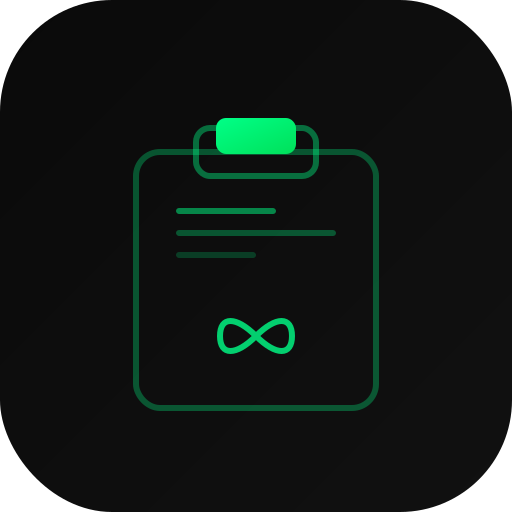

<div align="center">

<br>

<picture>
  <source media="(prefers-color-scheme: dark)" srcset="docs/assets/icon.svg">
  
</picture>

<br><br>

# everclip.

**The clipboard manager your Mac deserves.**

Native Swift. Apple Silicon. Free forever. Open source.<br>
Your data never leaves your machine.

<br>

[](https://github.com/thornebridge/everclip/releases/latest)
&nbsp;&nbsp;
[](https://thornebridge.github.io/everclip)

<br>


<br>

<sub>49 Swift files &middot; 5,100+ lines &middot; zero dependencies &middot; &lt;500KB binary</sub>

</div>

<br>

---

<br>

## Why EverClip

> Every time you copy something, you lose what was there before. Not anymore.

EverClip lives in your menu bar and silently captures everything you copy — text, links, images, code, colors, Markdown, files. It detects what each clip is, organizes it intelligently, and serves it back to you instantly with `⌘⇧V`.

No subscription. No cloud. No telemetry. Just a fast, native tool that does one thing exceptionally well.

<br>

## Features

<table>
<tr>
<td width="50%">

### 🔍 &nbsp;Smart Detection
Auto-recognizes 7 content types — text, URLs, code, images, files, colors, and Markdown. Each gets its own visual preview and icon.

### 📌 &nbsp;Pinboards & Tags
Color-coded collections with multi-board support. One clip can live in many places. Tags for flexible cross-cutting organization.

### ⚡ &nbsp;Smart Rules
Auto-route clips to pinboards by source app, content type, regex pattern, or URL domain. Zero manual sorting — ever.

### 📚 &nbsp;Paste Stack
`⌘⇧C` starts collecting. Every copy adds to the stack. Toggle again to paste everything in sequence. Batch workflows, perfected.

</td>
<td width="50%">

### 🔄 &nbsp;Paste Transformations
Right-click any clip → Paste as plain text, UPPERCASE, lowercase, Title Case, URL encode/decode, trim, or wrap in quotes.

### 🔎 &nbsp;Instant Search
Full-text search across your entire history. Filter by type, source app, or pinboard. Debounced DB queries — fast at 1M+ entries.

### ⌨️ &nbsp;Text Expansion
Create snippets with triggers like `;email` → expands to your full email. Template variables: `{{date}}`, `{{time}}`, `{{clipboard}}`.

### 🔒 &nbsp;Privacy First
Everything stays on your Mac. Exclude sensitive apps (password managers, banking). Pause capture anytime. Your clipboard, your rules.

</td>
</tr>
</table>

<br>

<details>
<summary><strong>More features</strong></summary>

<br>

- **Quick Look** — Press `Space` for a full-size preview of any clip
- **Drag & Drop** — Drag clips directly from EverClip into any app
- **Favorites** — Star important clips so they never get pruned
- **Theming** — Dark/light mode, custom accent colors, UI/font scale, card sizes, drawer material
- **Auto-updates** — Checks for new versions via GitHub (no server needed)
- **Launch at Login** — First-launch prompt + toggle in Preferences
- **DMG Installer** — Classic Mac drag-to-install experience
- **Custom App Icon** — Programmatically generated at 10 sizes

</details>

<br>

---

<br>

## Install

### Download

> **Recommended for most users.**

1. Grab the `.dmg` from the **[latest release](https://github.com/thornebridge/everclip/releases/latest)**
2. Open it and drag **EverClip** to **Applications**
3. First launch: **right-click → Open** (required once — the app is ad-hoc signed, not notarized)
4. Grant **Accessibility** permissions when prompted

<br>

### Build from source

```bash
git clone https://github.com/thornebridge/everclip.git
cd everclip
bash scripts/build.sh        # builds .app + .dmg
open EverClip.app
```

> Requires macOS 14+ (Sonoma) and Swift 5.9+. Builds natively for ARM64.

<br>

---

<br>

## Keyboard Shortcuts

<div align="center">

|  | Shortcut | Action |
|:--:|:--|:--|
| 📋 | `⌘` `⇧` `V` | Open / close EverClip |
| 📚 | `⌘` `⇧` `C` | Toggle Paste Stack |
| ← → | `←` `→` | Navigate between clips |
| ↵ | `Return` | Paste selected clip |
| 👁 | `Space` | Quick Look preview |
| 🗑 | `Delete` | Delete selected clip |
| ✕ | `Escape` | Close drawer |

</div>

<br>

---

<br>

## Architecture

```
Sources/EverClip/
├── main.swift                          # Entry point — NSApplication
├── AppDelegate.swift                   # Menu bar, hotkeys, lifecycle
│
├── Database/
│   ├── DatabaseConnection.swift        # SQLite handle + typed helpers
│   ├── MigrationManager.swift          # 4 versioned schema migrations
│   ├── EntryStore.swift                # CRUD + search + count queries
│   ├── PinboardStore.swift             # Pinboards + many-to-many junction
│   ├── TagStore.swift                  # Tags + entry associations
│   ├── SmartRuleStore.swift            # Rule CRUD + loadEnabled()
│   ├── SnippetStore.swift              # Snippet CRUD + abbreviation lookup
│   └── PreferencesStore.swift          # Key-value settings
│
├── Models/
│   ├── Pinboard.swift                  # Named, colored, ordered collections
│   ├── Tag.swift                       # Multi-tag per entry
│   ├── SmartRule.swift                 # Auto-categorization rules
│   ├── Snippet.swift                   # Text expansion with {{templates}}
│   └── PasteTransformation.swift       # 8 paste transform operations
│
├── Managers/
│   ├── ThemeManager.swift              # Observable theme tokens (singleton)
│   ├── SmartRuleEngine.swift           # Rule evaluation (AND/OR logic)
│   ├── PasteStackManager.swift         # Sequential multi-paste
│   └── UpdateChecker.swift             # GitHub-hosted version check
│
├── ViewModels/
│   ├── DrawerViewModel.swift           # DB-backed filtering + Combine
│   └── PinboardViewModel.swift         # Pinboard CRUD for UI
│
└── Views/
    ├── SidebarView.swift               # Pinboards, tags, favorites
    ├── FilterBarView.swift             # Search + content type chips
    ├── CardGridView.swift              # Horizontal scroll + context menus
    ├── StatusBarView.swift             # Item count + capture status
    ├── QuickLookPreviewView.swift      # Spacebar full preview
    ├── PinboardEditorView.swift        # Create/edit pinboard sheet
    ├── SmartRuleEditorView.swift       # Rule condition builder
    ├── SnippetEditorView.swift         # Snippet editor + template vars
    ├── PreferencesView.swift           # 5-tab settings window
    ├── AppearancePrefsView.swift       # Theme customization UI
    ├── MarkdownPreviewView.swift       # WKWebView markdown renderer
    └── PasteStackOverlayView.swift     # Floating collection indicator
```

<br>

---

<br>

## Tech Stack

<div align="center">

| Layer | Technology | Why |
|:------|:-----------|:----|
| **Language** | Swift 5.9+ | Native performance, zero runtime overhead |
| **UI** | SwiftUI + AppKit | Modern declarative UI with native window management |
| **Storage** | SQLite3 via C interop | WAL mode, 6 indexes, scales to 1M+ entries |
| **Hotkeys** | Carbon EventHotKey | System-wide shortcuts that work in any app |
| **Paste** | CoreGraphics CGEvent | Simulates ⌘V into the frontmost application |
| **Hashing** | CryptoKit SHA-256 | Content deduplication |
| **Markdown** | WKWebView | Custom renderer with dark mode CSS |
| **Updates** | URLSession + GitHub Pages | Zero-server version checking |
| **Login** | ServiceManagement | Native launch-at-login without helper apps |

</div>

<br>

---

<br>

## Performance

EverClip is built to handle **1,000,000+ clipboard entries** without breaking a sweat.

| Operation | How |
|:----------|:----|
| **Search** | SQL `LIKE` with debounced queries (200ms) — never filters in memory |
| **Dedup** | O(1) `Set<String>` hash cache + DB index fallback |
| **Sidebar counts** | `SELECT COUNT(*)` with indexes, not array scans |
| **Pruning** | `NOT EXISTS` subquery with entry_id index |
| **Capture** | In-memory window capped at 500 entries, DB is source of truth |
| **Smart rules** | Only enabled rules loaded, evaluated per-capture |

<br>

---

<br>

## Theming

Customize everything in **Preferences → Appearance**:

| Setting | Range |
|:--------|:------|
| Appearance | System / Light / Dark |
| Accent color | 9 presets + custom hex |
| UI scale | 75% – 140% |
| Font scale | 75% – 140% |
| Card size | Compact / Default / Large |
| Drawer material | 6 macOS vibrancy materials |
| Corner radius | 0 – 32px |

All settings persist to SQLite and apply live.

<br>

---

<br>

## Contributing

EverClip is MIT licensed. PRs welcome.

```bash
# Clone
git clone https://github.com/thornebridge/everclip.git
cd everclip

# Build + run
swift build && .build/debug/EverClip

# Release build + DMG
bash scripts/build.sh
```

The codebase is intentionally simple: 49 Swift files, zero external dependencies, no Xcode project needed. Just Swift Package Manager.

<br>

---

<br>

<div align="center">

<picture>
  <source media="(prefers-color-scheme: dark)" srcset="docs/assets/icon.svg">
  
</picture>

<br><br>

**Powered by [Thornebridge](https://thornebridge.tech)**

We build technology for a reason.

<br>

<sub>MIT License &middot; Copyright 2026 Thornebridge</sub>

</div>
